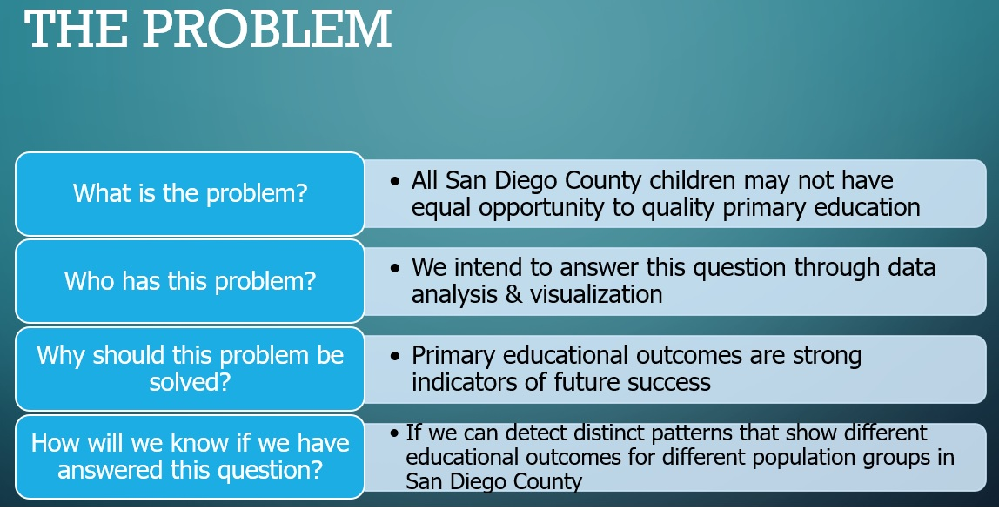
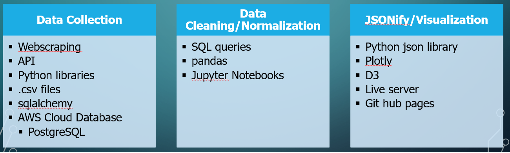
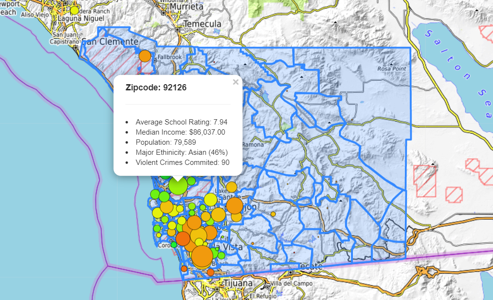
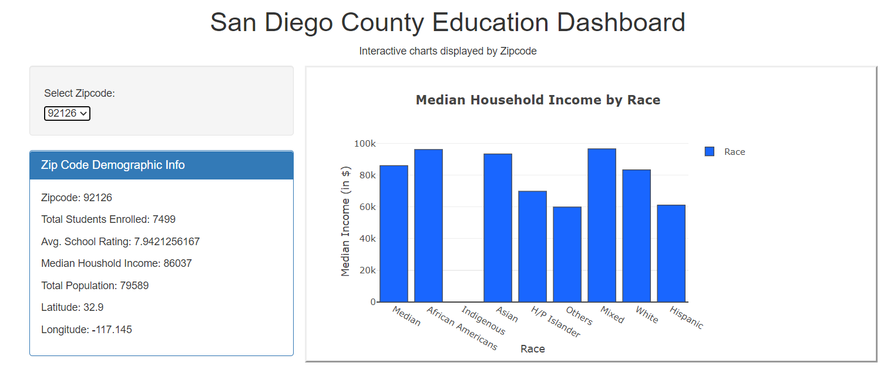
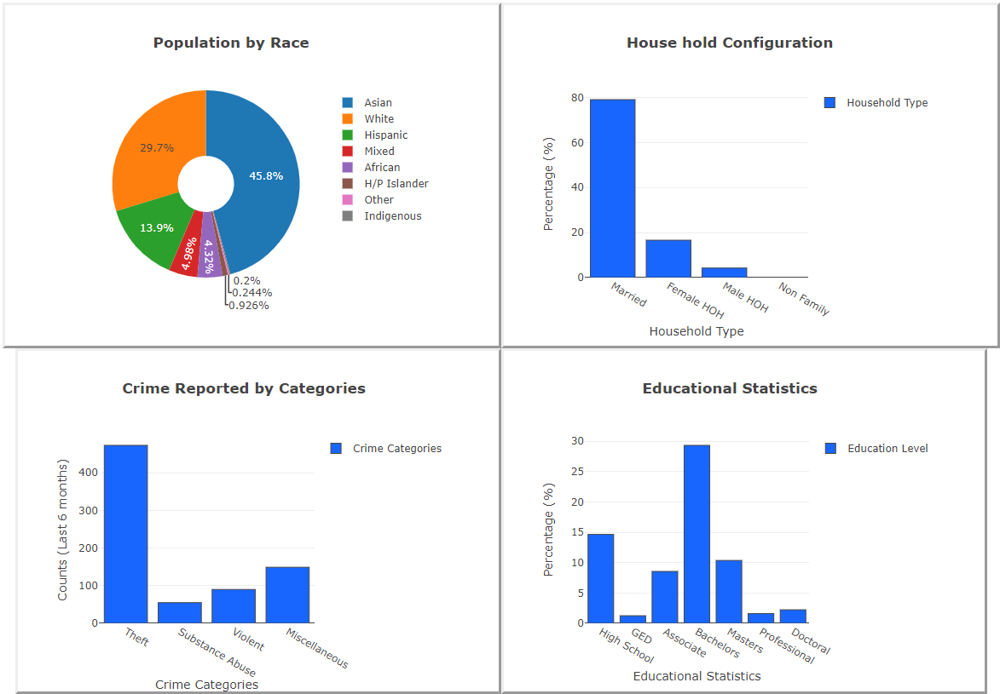

# Does the Public Education System serve all Residents in San Diego County Equally?

With this visualization we are trying to see the impact of better schools have on the people's lifestyle in the vicinity. We try to identify how the community with better rated school fared as compared to schools with lower ratings. We have identified data from various sources like Greatschools.com, Census surveys and Sandag.gov to identify relevant data and publish it on the dashboard through interactive ploty visualizations and maps. All the data has been displayed on the dashboard with Zipcode as a filter option. This dashboard provides the relevant information like Average School rating, median income, Major ethinicity, Crime and more around the Zipcode. 

We have used the following to perform our ETL process as well as visualizations.

With all the process we have created the following Dashboard

